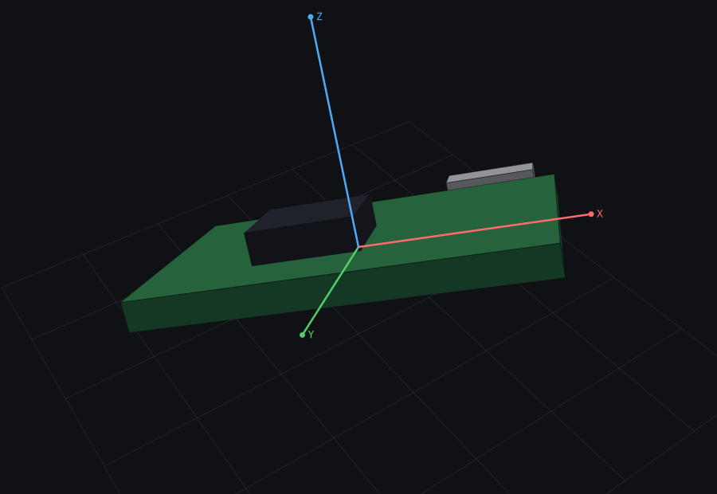

# hiwonder-10-axis-imu

Read a Hiwonder 10-axis IMU (accelerometer, gyroscope, magnetometer, barometer)
over USB serial from a Mac, with Python.

## Quick start

```bash
python3 -m venv .venv && source .venv/bin/activate
pip install -e ".[dev]"

hiwonder-imu --list-ports        # find the device
hiwonder-imu                     # live roll/pitch/yaw, accel, gyro
hiwonder-imu --raw -n 20         # 20 decoded frames, one line each
```

On macOS you may need a USB-serial driver for the adapter on the board
(CP210x, CH340 or FTDI). Once installed the device shows up as something like
`/dev/cu.usbserial-0001`.

## In your own code

```python
from hiwonder_imu import ImuReader

with ImuReader() as imu:          # or ImuReader("/dev/cu.usbserial-0001")
    for sample in imu.samples():
        print(sample.angle)       # (roll, pitch, yaw) in degrees
```

`ImuSample` fields:

| field | unit |
| --- | --- |
| `accel` | m/s² |
| `gyro` | deg/s |
| `angle` | degrees (roll, pitch, yaw) |
| `mag` | raw counts |
| `quaternion` | unitless (w, x, y, z) — w comes first |
| `pressure` | Pa |
| `altitude` | metres |
| `temperature` | °C |

Any field the board isn't currently sending stays `None`.

More in [`examples/`](examples/): [`print_angles.py`](examples/print_angles.py)
and [`log_to_csv.py`](examples/log_to_csv.py).

## 3D view

```bash
hiwonder-imu --view          # live, from the board
hiwonder-imu --demo          # fake motion, no hardware needed
```

Opens a page in your browser showing a board that turns with the sensor, next
to live numbers for angle, acceleration, gyro and temperature. Drag to orbit,
scroll to zoom, `R` resets the view, `Z` zeros the yaw so "straight ahead" is
wherever the board is pointing now.



It's a plain local web page served from Python — no GUI toolkit, no JavaScript
build step, nothing fetched from the internet. Pass `--http-port` to move it off
8420, or `--no-browser` if you'd rather open the tab yourself.

## Wire format

The board streams fixed 11-byte frames:

```
0x55  <type>  d0 d1  d2 d3  d4 d5  d6 d7  <checksum>
```

Four little-endian signed 16-bit values per frame; the checksum is the low byte
of the sum of the first ten bytes. Frame types are `0x51` accel, `0x52` gyro,
`0x53` angle, `0x54` magnetometer, `0x56` barometer, `0x59` quaternion. The
parser drops bad bytes one at a time, so it recovers on its own if you plug in
mid-stream.

Three things are easy to get wrong here, all confirmed against a real board:

- The barometer frame holds **two 32-bit** values (pressure in Pa, altitude in
  cm), not four 16-bit ones like every other frame.
- The quaternion arrives **w first**, not w last.
- Only the accelerometer and gyro frames carry a real temperature in their
  fourth slot. The angle frame puts a firmware version there and the
  magnetometer frame leaves it at zero.

Scale factors are ±16 g, ±2000 deg/s and ±180°, and the default baud rate is
9600. If your board is configured differently the numbers will be wrong by a
constant factor — `hiwonder_imu/protocol.py` is where to change them.

## Tests

```bash
pytest
```

The parser tests build synthetic frames, so they run without hardware.

## License

MIT
